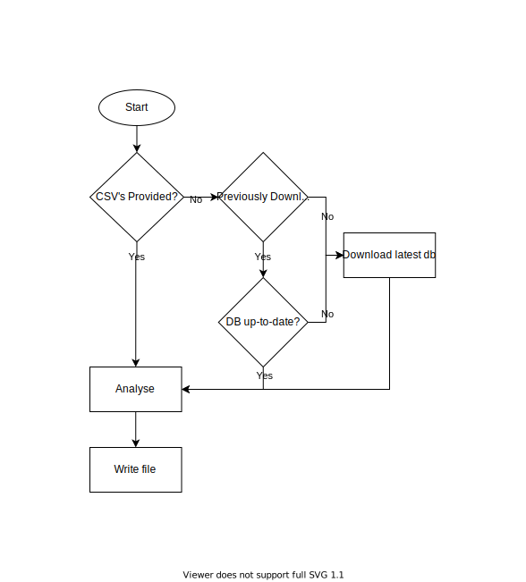

# mindproxy

A ruby script that parses the maxmind csv database files to produce a haproxy
compatible acl config file.

## Installation

Dependencies are specified in the Gemfile provided.
```
cd mindproxy
bundle install
```
You can also use the docker file provided
```
cd mindproxy
docker build -t mindproxy:1
docker run -e MAXMIND_LICENSE_KEY=<A VALID MAXMIND KEY> maxmind:1 <OPTIONS>
```
See usage for the cli options

## Usage

```
./mindproxy.rb -h
usage: ./mindproxy.rb [options]
    -c, --citycsv      The maxmind city database csv
    -i, --ipblockscsv  The maxmind ip blocks database csv
    -a, --countryiso   The optional country code (ISO).
    -n, --countryname  The optional country name
    -s, --subdivision  A subdivision of a country. Eg Crimea
    -o, --outputfile   The ouptut haproxy config file
    -l, --license      A maxmind license key
    -d, --dir          The directory to download to
    -h, --help         Prints help message

```


Any of country name, country iso and country subdivision will be combined
as a logical OR to filter the results found in the CSV file specified by -f.
The string must exactly match the respective entry in the CSV

## Program Flow



## Examples

```
#Filter North Korea(KP), Cuba, and Crimea

./mindproxy.rb \
-c /tmp/GeoLite2-City-CSV_20210713/GeoLite2-City-Locations-en.csv \
-i /tmp/GeoLite2-City-CSV_20210713/GeoLite2-City-Blocks-IPv4.csv \
-a KP -n Cuba -s Crimea -o test.conf -l <A VALID MAXMIND KEY>

#Download the latest db csv files and with the same filters as above, but use
specify the license using the MAXMIND_LICENSE_KEY environment variable

MAXMIND_LICENSE_KEY=<A VALID MAXMIND KEY> ./mindproxy.rb -a KP -n Cuba \
-s Crimea -o test.conf

head test.conf
5.59.104.0/24
5.62.56.73/32
5.62.56.74/31
5.62.56.160/30
5.62.58.69/32
5.62.58.70/31
5.62.61.64/30
5.101.208.0/21
31.3.24.0/21
31.40.128.70/32
```


## Tests

To run the test suite.

```
cd mindproxy
rpsec
```

